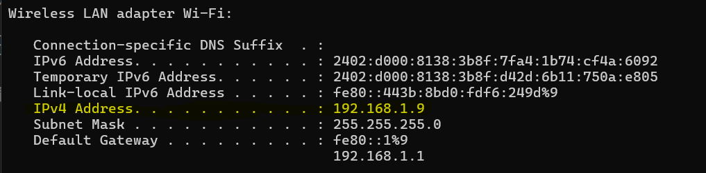

# Distributed Project Management Application

### Pre requirements
* Set up docker in your local machine.
* Create a Database Instance in Mongo DB Atlas and copy the instance URL.
* Create the ".env" file in the root of the load-balancer directory.
* Add DB_URL to your .env file with your Database URL as below.
```markdown
    DB_URL=mongodb+srv://dinin...
``` 
* Open a terminal in the host device and run below command.
```markdown
    ipconfig
``` 
* Then go to the "Wireless LAN adapter Wi-Fi" section and get the IPv4 address.



* Open the docker-compose.yml file and change the frontend/environment section URLs with your host machine IP.

```markdown
frontend:
    build: 
      context: Project-Management-App
      dockerfile: Dockerfile
    environment:
      - REACT_APP_BASE_URL=http://192.168.1.9:8080
      - REACT_APP_SOCKET_URL=http://192.168.1.9:4000
    ports:
      - "3000:3000"
    depends_on:
      - load-balancer
      - socket-be
``` 

## Instrunctions

* Clone the file using git clone command.
* Start Docker.
* Open a CLI in the project directory.
* Run the command below,
```markdown
    docker-compose up -d --build
``` 
* Visit the link below using any browser, refresh and see how the running ports are changed.
```markdown
    http://localhost:8080/
``` 
* Then visit to the below link to see the actual distributed project.
```markdown
    http://localhost:3000/
``` 
### Access the application using another device

* To access this application using another device, the device should be connected to the same WiFi network.
* Then open a new terminal in the host device and run below command.
```markdown
    ipconfig
``` 
* Then go to the "Wireless LAN adapter Wi-Fi" section and get the IPv4 address.


* Now you can access the application by pasting the ip address with the port 3000.
```markdown
    Ex: 192.168.1.9:3000
``` 

### Shutdown the running application

* run below command in the running terminal to shoutdown the application.
```markdown
    docker-compose down
``` 